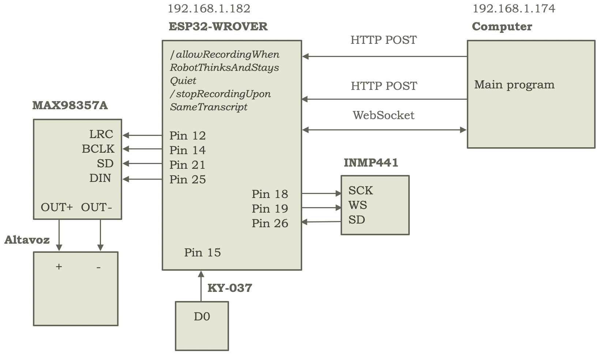

Finally, for audio capture and playback, two 170-pin breadboards are used, the first on the first level, at the front, and the second on the rear spoiler, at the back, to place a KY-037 (sound detector) and INMP441 (microphone) for audio capture, at the front, and a MAX98357A amplifier (connected to an 8Ω, 3W speaker), for output, at the back.

In this way, when the KY-037 detects a sound above its threshold, which is configured via a potentiometer, it sends a signal via its D0 pin, which, connected to pin 15 of the WROVER, allows it to indicate to it—using a variable, `soundDetected`, updated in the interrupt handler, if `allowRecording` permits it (for example, denying it if the robot is in audio output mode)—that a sound has been detected, with the WROVER then proceeding to read the data from the INMP441, in a task, `microphoneTask`—via `xTaskCreatePinnedToCore`, to run concurrently with the audio playback task, `audioPlaybackTask`, although one of them always blocks the other, or at times when no sound exists nor is the robot speaking, neither executing anything more than wait loops—which is logically unblocked by `soundDetected` and which reads the data via SD—Serial Data—, connected to pin 26 (and with SCK—Serial Clock—and WS—Word Select—, connected to pins 18 and 19, respectively), to be sent via a WebSocket (hosted on the main computer, port 8888) to the computer so it can transcribe it with Speech-to-Text, pass the text to the vision-language model, and convert part of its response (see, the one corresponding to `"speak"` in the JSON of commands to the robot) to audio via Text-to-Speech, to, via the same WebSocket, send said audio to the WROVER which in turn sends it to the amplifier (via pin 25, connected to DIN—Digital Input—, with LRC—Left/Right Clock—, BLCK—Bit Clock—and SD—ShutDown—connected to pins 12, 14, and 21, respectively) which finally sends it to the speaker for playback.

It should be noted, similarly, that both the KY-037—on the front 170-pin breadboard—and the MAX98357A—on the rear 170-pin breadboard—are powered from the 5V + and - columns of the 400-pin breadboard, while the INMP441 (also on the front 170-pin breadboard) is powered at 3.3V from the output of a second buck converter which takes 5V current as input—from the 400-pin breadboard—and outputs it at 3.3V, necessary to avoid damaging the microphone, which does not support 5V power.

From the computer's point of view (i.e., having received an audio message via the WebSocket), messages are either processed (adding it to the computer's buffer, `audio_buffer`, and calling `STT_MODEL` every `CHECK_INTERVAL` seconds), or they are ignored if `is_robot_thinking()` is true (which reads `robot_thinking`, which is set to true when the robot is in thinking mode, and occurs both when (a) `MAX_SAME_TRANSCRIPTS` identical consecutive transcriptions are reached—in such case, with the computer calling `/stopRecordingUponSameTranscript` to stop the audio sending from the WROVER, but in any case blocking itself similarly with `set_robot_thinking(True)`—, and when (b) `END_OF_AUDIO_SIGNAL` is received from the WROVER for having reached `MAX_RECORDING_DURATION_MS` of audio sending, again entering thinking mode with `set_robot_thinking(True)`). That is, from the moment the WROVER notifies that it has finished its sending, or the computer decides it doesn't want more audio because background noise is likely being sent and the user isn't speaking (due to the last `MAX_SAME_TRANSCRIPTS` being the same transcription), it switches to thinking mode, which blocks the processing of (i.e., ignores) new audio messages sent by the WROVER until the execution of the vision-language model is complete. Thus, only after the vision-language model is executed, in the `vision_language_model_call` function, is `set_robot_thinking(false)` set, so that the audio server on the computer resumes processing incoming audio messages from the WebSocket, and therefore again allowing the user, after the VLM's potential response to their message, to send a new audio communication.

From the robot's point of view, and after the execution of the vision-language model on the computer, the WROVER receives (from the computer) the notification of being able to send audio again, either (a) with a POST to the `/allow_recording_when_robot_thinks_and_stays_quiet` endpoint (which sets `allowRecording` to true), called when the model has finished thinking and decides not to speak (and therefore, somehow the WROVER must be notified that it can send audio again), or (b) implicitly, if the model does decide to speak, with `END_OF_AUDIO`—sent as the last message from the computer after the last piece of audio data to be spoken by the robot's speaker—which the WROVER interprets as the end of audio sending for playback and therefore as a signal to reactivate attention to interrupts from the KY-037 to change `soundDetected` to true, by setting `allowRecording` to true—which otherwise blocks the change.

Furthermore, it is noteworthy that, to avoid the playback of strange sounds or noise after the robot finishes a block of speech, the SD—ShutDown—pin of the amplifier is controlled, setting it to HIGH when speaking, and to LOW, after sending a short period of silence, otherwise.

Similarly, it should be mentioned that, from the WROVER's perspective, audio playback is managed by a task, `audioPlaybackTask`, which continuously executes the `playAudio` function (with a short pause between executions) which in turn attempts to take `speakingBufferSemaphore` and, if it is taken, ensures that `isSpeaking` is not true and the buffer index, `speakingBufferIndex`, is greater than 0, so that if this is the case, it (i) sets `isSpeaking` to true—to not play more audio in a new call to `playAudio` until the current playback is finished—, (ii) activates the MAX98357A—which is kept LOW otherwise—, (iii) sends the audio from the start position of `speakingBuffer` up to `speakingBufferIndex` to the amplifier with `i2s_write`, and (iv) sets `speakingBufferIndex` back to 0 and `isSpeaking` to false, prior to releasing control of the semaphore so that `processAudioChunk` can take it in the future.

`processAudioChunk`, invoked from the `onMessageCallback` on the WROVER, precisely, receives the audio messages to be played, and takes control of `speakingBufferSemaphore` when it can, to store them in the playback buffer, `speakingBuffer`, starting from `speakingBufferIndex`, which indicates the last position to be played, incrementing it by length after storage and calling `playAudio` if the buffer's end position were to be exceeded, prior to setting `speakingBufferIndex` to 0.

Thus, the WebSocket's `onMessageCallback` function—on the WROVER—is responsible for invoking `processAudioChunk` when new audio arrives from the computer, while the playback task, `audioPlaybackTask`, is responsible for periodically trying to play the audio written in the buffer, synchronizing their access via `speakingBufferSemaphore`.

It is also noteworthy that, after receiving `END_OF_AUDIO_SIGNAL` in the WebSocket's `onMessageCallback` function, it waits periodically until `speakingBufferIndex` is 0, to try not to deactivate the amplifier with a final audio message pending playback or in playback—although this could be controlled with another variable, more safely than checking that `speakingBufferIndex` is 0, which could also occur due to a message that, by adding its size to the last position to be played, exceeded the `speakingBuffer`'s position, which would force `playAudio` to be called (resetting `speakingBufferIndex` to 0) to make space for the new message, still needing to be played, but which could generate a race condition with the amplifier deactivation in the `onMessageCallback`.

Finally, in terms of size, it should be noted that for audio capture, the incoming values from the INMP441 are copied into `listeningBuffer`, of 1024 positions of 2 bytes (as int16_t), using 10 DMA buffers of 1024 positions of 2 bytes with `i2s_read`, and are immediately sent via the WebSocket to the computer, while to store the audio to be spoken by the robot, a buffer (`speakingBuffer`) of 32768 positions of 1 byte (as uint8_t) is used on the WROVER, which are interpreted as the lower and upper parts of a 16-bit PCM (Pulse-Code Modulation) format value (sent, in turn, as two 8-bit values from the computer).

Thus, in audio capture, the incoming audio values from the INMP441 are copied into `listeningBuffer` on the WROVER, and immediately sent via the WebSocket, accumulating the audio in `audio_buffer` on the computer, which is the logical counterpart to the `speakingBuffer` accumulation buffer on the WROVER for playback, whereas in playback, the audio incoming via the WebSocket is stored in `speakingBuffer` on the WROVER, until the `audioPlaybackTask` task copies them (via `i2s_write`, using 10 DMA buffers and 1024 positions) to the MAX98357A, changing `speakingBufferIndex` after that to mark said positions as already played, with `audioPlaybackTask` playing said data, synchronized with `processAudioChunk` (called in the `onMessageCallback`) via the `speakingBufferSemaphore`.

In general, given a sample rate of 16KHz or 16k samples per second, a single channel (mono), and a bit depth of 16 (or 2 bytes), this results in a total bandwidth of 16k samples/second \* 1 channel/sample \* 2 bytes/channel = 32 KBps.

Therefore, it is expected that `listeningBuffer` (1024 positions of 2 bytes) will be filled ~15.63 times/second (or 16k samples/second / 1024 samples or positions in the buffer), and `speakingBuffer` (32768 positions of 1 byte, or space for 16384 samples of 2 bytes) will be filled ~1 time/second, while the 10 DMA buffers (1024 positions of 2 bytes) will do so ~15.63 times/second, but with only one buffer used at a time (i.e., an average utilization of 10%).

Schematically, the communication summary between the different components for audio management can be seen in the Figure.

    
    
Communication summary between computer, ESP32-WROVER, KY-037, INMP441, MAX98357A, and speaker for sound detection, sending it to the computer (where it's converted to text using Speech-to-Text, to serve as input to the vision-language model and whose speech response part is converted to audio with Text-to-Speech), receiving stop signal, and sending audio back, to be played by the robot's speaker.

Finally, it's worth noting that for Speech-to-Text and Text-to-Speech processes, `whisper-tiny` (with Transformers) and `tts_models/es/css10/vits` (with `coqui-ai/TTS`, cloning a CC0-licensed voice from [FreeSound](https://freesound.org/)) are used.
